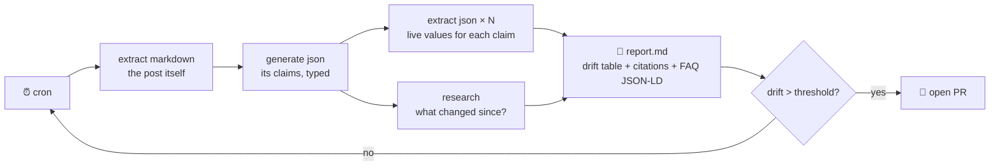

# 🍳 Recipes

  

> [!NOTE]
> For thirty years the deal with search engines was: you type, they list, you click, you copy. **That deal is over.** A programmable search engine returns answers with citations, JSON shaped like your schema, or a finished browser session. The web stopped being a place you visit and became a standard library you call.

## The four verbs

| Verb | In | Out | Feels like |
|------|----|----|------------|
| `extract` | URL + JSON schema | Your types, filled in | The web as a database |
| `research` | A question | Cited, synthesized answer | Search that shows its work |
| `generate` | URL + instructions + schema | The page, transformed | `map()` over a webpage |
| `automate` | A task in plain English | A browser does it, streaming events | An intern with a guardrail |

Everything composes because of three rules: **data → stdout, progress → stderr, JSON when piped.** Your old friends `jq`, `cron`, and `&&` do the rest.

## 📋 The menu

| # | Recipe | Heat | Verbs | The dish |
|---|--------|:----:|-------|----------|
| 1 | [Hacker News, but typed](#-1-hacker-news-but-typed) | 🟢 | `extract` | The front page as a typed feed |
| 2 | [Docs → context](#-2-docs--context) | 🟢 | `extract` | Any page, clean, in your clipboard |
| 3 | [The price tag](#-3-the-price-tag) | 🟢 | `extract` | An exit code that watches prices |
| 4 | [Changelog roulette](#-4-changelog-roulette) | 🟢 | `generate` | "Does this release break *me*?" |
| 5 | [The star drift detector](#-5-the-star-drift-detector) | 🟡 | `extract` | Catch your content lying |
| 6 | [The citation machine](#-6-the-citation-machine) | 🟡 | `research` | ADRs with receipts |
| 7 | [CI for facts](#-7-ci-for-facts) | 🟡 | `generate` | Fail the build when the landing page lies |
| 8 | [The geo sleuth](#-8-the-geo-sleuth) | 🟡 | `extract` | One pricing page, three countries, one diff |
| 9 | [Forms with a conscience](#-9-forms-with-a-conscience) | 🔴 | `automate` + `input` | Human-in-the-loop, for real |
| 10 | [The post that fact-checks itself](#-10-the-post-that-fact-checks-itself) | 🔴 | all of them | Content with a pulse |

---

### 🟢 1. Hacker News, but typed

**You get:** the front page as structured data. No RSS, no parser, no `BeautifulSoup`.
**Pairs with:** your terminal greeting, a Slack webhook, breakfast.

```bash
tabstack extract json https://news.ycombinator.com \
  --schema '{"type":"object","properties":{"stories":{"type":"array","items":{
    "type":"object","properties":{"title":{"type":"string"},
    "url":{"type":"string"},"points":{"type":"number"}}}}}}' \
  | jq -r '.stories[:5][] | "\(.points)▲  \(.title)"'
```

<details>
<summary>📟 Actual output (today, unedited)</summary>

```text
790▲  Show HN: Homebrew 6.0.0
81▲   Shall we play a game? – LLMs use tactical nukes in 95% of simulations
375▲  MiMo Code is now released and open-source
23▲   Show HN: FablePool – pool money behind a prompt, and Fable builds it in public
279▲  Petition to Withdraw Canada's Bill C-22
```

</details>

---

### 🟢 2. Docs → context

**You get:** any docs page as clean markdown — 4KB of signal instead of 400KB of div soup.
**Pairs with:** your clipboard, your agent's context window, a 100× token discount.

```bash
tabstack extract markdown https://bun.sh/docs/api/spawn | jq -r .content | pbcopy
```

> [!TIP]
> Piped output is JSON automatically — that's why the `jq -r .content` is there. On a TTY you'd just see the markdown.

---

### 🟢 3. The price tag

**You get:** an exit code that knows when to buy.
**Pairs with:** `cron`, `&&`, impulse control.

```bash
tabstack extract json "$PRODUCT_URL" \
  --schema '{"type":"object","properties":{"price":{"type":"number"}}}' \
  | jq -e '.price < 499' && open "$PRODUCT_URL"
```

`jq -e` exits non-zero when the condition is false. The whole alerting system is the shell.

---

### 🟢 4. Changelog roulette

**You get:** the one answer you actually wanted from 40 release notes.
**Pairs with:** dependabot anxiety.

```bash
tabstack generate json https://github.com/sveltejs/kit/releases \
  --instructions "I'm on @sveltejs/kit 2.x with adapter-cloudflare. Anything in recent releases that breaks me?" \
  --schema '{"type":"object","properties":{"breaking":{"type":"boolean"},
    "verdict":{"type":"string"}}}' \
  | jq -r '.verdict'
```

---

### 🟡 5. The star drift detector

**You get:** proof that your published numbers are stale.
**Pairs with:** humility.

```bash
for repo in anthropics/claude-code anomalyco/opencode openai/codex; do
  echo "$repo: $(tabstack extract json "https://github.com/$repo" \
    --schema '{"type":"object","properties":{"stars":{"type":"number"}}}' \
    | jq .stars)"
done
```

<details>
<summary>📟 What it caught in a real post (11 weeks of drift)</summary>

| Repo | Post claimed | Live | Drift |
|------|-------------:|-----:|------:|
| anthropics/claude-code | 83,000 | 131,792 | **+59%** |
| anomalyco/opencode | 130,700 | 173,196 | +33% |
| openai/codex | 67,700 | 90,457 | +34% |

Two of the ten tools in that post had also been *renamed*. The follow-up post was written from this diff — see recipe 10.

</details>

---

### 🟡 6. The citation machine

**You get:** architecture decision records with receipts.
**Pairs with:** the colleague who asks "source?" in every review.

```bash
tabstack research "CRDTs vs operational transforms for a collaborative editor in 2026" \
  > /tmp/r.ndjson
jq -r 'select(.event=="complete") | .data.report' /tmp/r.ndjson > docs/adr/007-crdts.md
jq -r 'select(.event=="complete") | .data.metadata.citedPages[] | "- [\(.title)](\(.url))"' \
  /tmp/r.ndjson >> docs/adr/007-crdts.md
```

> [!TIP]
> Piped research streams **NDJSON — one event per line** — so `jq 'select(.event=="...")'` is your event handler. No SSE parser, no library, no drama.

---

### 🟡 7. CI for facts

**You get:** a build that fails when your landing page lies.
**Pairs with:** a weekly GitHub Action and marketing's forgiveness.

```bash
tabstack generate json https://yoursite.com \
  --instructions "List every quantitative claim on this page (numbers, counts, latencies) with its exact text." \
  --schema '{"type":"object","properties":{"claims":{"type":"array","items":{
    "type":"object","properties":{"text":{"type":"string"},"value":{"type":"number"}}}}}}' \
  | jq -e '.claims | length > 0'
```

"Trusted by 500+ teams." "Sub-100ms p99." Cool — `assert` it. Content rot caught like a failing test, because that's what it is.

---

### 🟡 8. The geo sleuth

**You get:** the same pricing page from three countries, diffed.
**Pairs with:** the phrase "regional pricing strategy."

```bash
for cc in US GB IN; do
  tabstack extract json "$PRICING_URL" --geo "$cc" --nocache \
    --schema '{"type":"object","properties":{"pro_price":{"type":"string"}}}' \
    | jq -r "\"$cc: \" + .pro_price"
done
```

---

### 🔴 9. Forms with a conscience

**You get:** a browser that fills forms from JSON, can't buy anything unless you say so, and *asks you* when it's stuck.
**Pairs with:** conference season.

```bash
tabstack automate "register for the conference using my details" \
  --url "$CONF_URL" --data @me.json --allow-actions
```

<details>
<summary>📟 What the pause looks like mid-stream</summary>

```text
· navigated: https://conf.example.com/register
· action: fill (name, email, company)
· input requested (expires in ~2 minutes)
  respond with: tabstack input req-7f3a --data '{"fields":[{"ref":"dietary","value":"..."}]}'
  or decline:   tabstack input req-7f3a --data '{"cancelled":true}'
```

Answer from a second terminal; the stream resumes where it paused:

```bash
tabstack input req-7f3a --data '{"fields":[{"ref":"dietary","value":"vegetarian"}]}'
```

</details>

> [!WARNING]
> `automate` is **read-only by default** — the CLI injects a "browse and extract only" guardrail unless you pass `--allow-actions` or your own `--guardrails`. The flag is the consent.

---

### 🔴 10. The post that fact-checks itself

**You get:** published content with a pulse — a scheduled job re-extracts every claim, researches what changed, and reports the drift.
**Pairs with:** recipe 5, a cron schedule, and the quiet confidence of being right on purpose.



```bash
./scripts/enrich-post.sh https://yoursite.com/blog/your-stale-masterpiece
# → enrichment/<slug>/report.md
```

This isn't hypothetical. [The June 2026 edition](https://zero8.dev/blog/state-of-agentic-harnesses-june-2026) of an agentic-tools comparison was produced by exactly this loop — [`scripts/enrich-post.sh`](./scripts/enrich-post.sh), ~100 lines of shell, every number re-extracted, every development researched and cited. The [March original](https://zero8.dev/blog/state-of-agentic-harnesses-march-2026) had drifted up to 59% in eleven weeks.

---

## Why this isn't scraping

Scraping was adversarial — you against the markup, and the markup always won eventually. Selectors break, layouts shift, parsers rot. This is declarative: **you describe the shape of the truth you need, and the engine deals with the web's mess.** When the page redesigns, your schema doesn't care.

The interesting work moves up a level — to the questions you ask and the pipelines you compose.

The web was always the world's largest database. It just took thirty years to get a query language.
